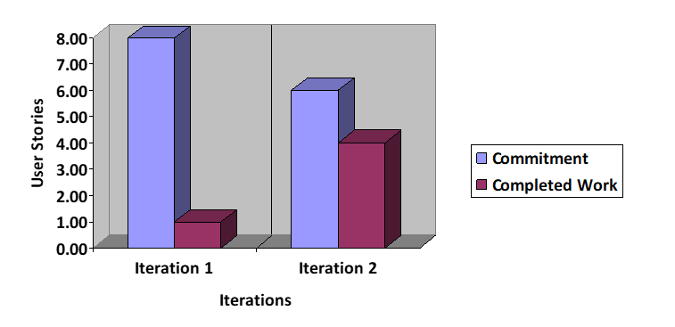

# Failures

### Discuss a part of your project that has not been as successful as you would have liked, and how it can be improved in this iteration (do this early!).

During iteration 2, we are implementing objects in the presentation layer instead of accessing the actual database. In this iteration we can make the notes and flashcards created from the database. The "quizzing" happens on different categories types with no quizzing on true-false questions. 

Additionally, the UI is very basic and not very interactive. The student cannot edit the notes or even view all of them. Instead, they have to cycle through all the notes. This is very tedious. It would be more successful to allow the user to view all of their notes. Additionally, the user currently sees all the notes instead of having their own. Similarly, for flashcards we can make the UI more interactive and they could type in answers for this iteration rather than just guessing and then clicking reveal answer.

# Improvement

### Determine concrete (and realistic) ways of improvement and decide how its success will be evaluated at the end of the iteration (measurable and objective).

To measure the improvement of the app, we shall be asking our friends, family and fellow classmates to test the app now, at the beginning of Iteration 3, and at the end of the Iteration. We will be interviewing them asking them to rate the functionalities listed above on all a scale of 0 to 5 during both interviews. 

The app can be improved by implementing actual features such as editing, creating, and deleting notes and flashcards that makes the useful for students as it is the main objective of the app. Success will be evaluated based on the condition that the user can execute these main tasks as well as viewing all their flashcards and notes and selecting the specific one, they choose to edit/delete. Interviewees will be asked to rate viewing notes, creating notes, editing notes, deleting notes, viewing flashcards, creating different types of flashcards, deleting, and editing various flashcards. 

Additionally, the existence of flashcards (containing questions) is relatively useless unless the user can quiz themselves on it and get feedback. An improvement on the current system would be to introduce some sort of feedback regarding the quizzing in terms of a summary page with all the questions asked, answers given and correct answers as well as a score. The quizzing on the flashcards should be all flashcards at once not quizzing on different flashcard categories. 

The app can also be improved by making a better UI and more interactive. One way this can be improved is by having a consistent layout - similar buttons and text through out. Additionally, this can be improved by having better designed pages that are more intuitive and aesthetically pleasing. 

# Project Velocity

## Also include a chart (as an image) showing the 2 data points of project velocity from the last two iterations.

